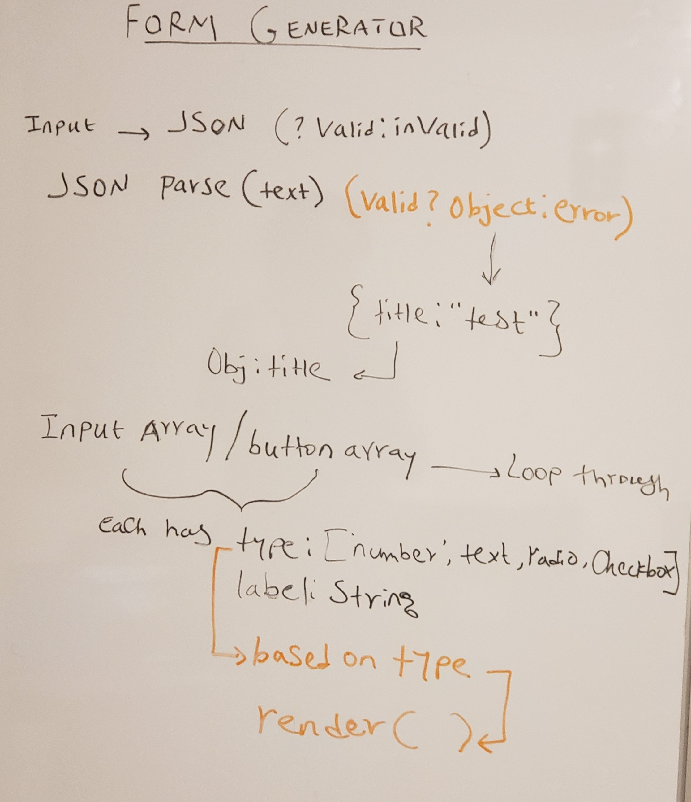

# lab-27
Dynamic Forms

### Author: Meron

### Links and Resources
* [codesandbox](http://xyz.com)
* [travis](http://xyz.com)
* [Netlify](https://lab-13app.herokuapp.com/)

#### Documentation
* [jsdoc](comments only)
* [styleguide](https://github.com/shri/JSDoc-Style-Guide#functions)

### Component
* FormInput
* JsonInput

#### Action
* formAction
* jsonAction
#### reducers
* FormReducers
* jsonReducers
* root index.js

### Setup
#### `.env` requirements
* `PORT` - 3000
* 

#### Running the app
* `npm start`

  
#### Tests
* npm test 

#### UML
- 

